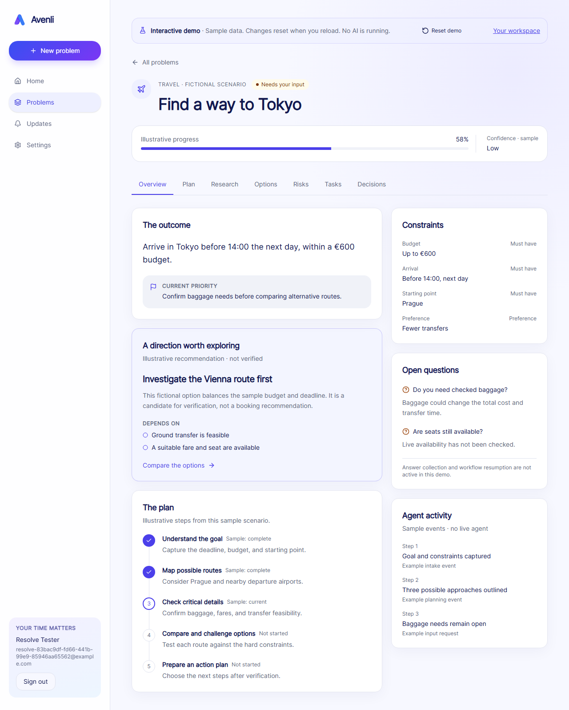

# Avenli

**Give it a problem. Get it solved.**

Avenli is an outcome-oriented AI problem workspace in development. **Phases 1–16** implement accounts, eight server-side agents, durable Supabase workflows, checkpoint recovery, daily monitoring, notifications, optional Google context, explicitly approved Calendar actions, onboarding, production web polish and release hardening using Nebius/NVIDIA and Tavily. Create a problem, follow saved progress, inspect research, answer clarification questions, continue an interrupted analysis, monitor a completed result and prepare a reviewable Calendar event. Fictional examples remain available through **Explore demo**.

[Try the production app](https://avenli.vercel.app) · [Explore the public demo](https://avenli.vercel.app/demo) · [Architecture](docs/architecture.md) · [Demo guide](docs/demo.md)



## Local setup

Use Node.js **24 LTS** and npm (minimum supported Node version is specified in `package.json`). Dependencies are pinned by `package-lock.json`.

```powershell
npm ci
npm run dev
```

Open [127.0.0.1:3000](http://127.0.0.1:3000). Sign in to create a saved problem or explore the demo examples. Public pages render without Supabase; accounts and private screens require the configuration below. Private routes fail closed if configuration is missing.

## Supabase setup

The Supabase CLI is a local dev dependency. To run the full local stack, install and start **Docker Desktop with Linux containers**, then:

```powershell
npm run db:start
Copy-Item .env.example .env.local
npx supabase status
```

Copy the local API URL (`http://127.0.0.1:55421`) and **publishable key** from the CLI output into `.env.local`. Set `SITE_URL=http://127.0.0.1:3000` and restart Next.js. Use the same hostname consistently; localhost and 127.0.0.1 have separate cookies. Clients accept only modern `sb_publishable_...` keys. Never use secret/service-role keys in `NEXT_PUBLIC_` variables. Resolve uses ports 55420–55429 to coexist with other local Supabase projects.

For an existing hosted Supabase project, use its project URL and publishable key instead. This phase does not create or modify a hosted project.

`supabase start` applies migrations to a fresh local stack. After editing migrations during early local development, use `npm run db:reset` **only when you intend to erase and recreate the local database**. Stop local services with `npm run db:stop`.

No seed data is installed. A trigger creates profiles in the Auth signup transaction. Local email confirmation is enabled: open [local Mailpit](http://127.0.0.1:55424) for confirmation/recovery emails. The app also supports projects with confirmation disabled. For an existing local stack, `npx supabase migration up --local` applies new migrations without resetting its data. Restart the local stack after Auth configuration changes.

See [`docs/authentication.md`](docs/authentication.md) for required hosted email templates, redirect settings, recovery design, and testing. SQL migrations alone do not configure a hosted project's Auth settings.

## Database

Migrations: [`20260909000000_resolve_foundation.sql`](supabase/migrations/20260909000000_resolve_foundation.sql) for schema/RLS, [`20260909010000_auth_profiles.sql`](supabase/migrations/20260909010000_auth_profiles.sql) for profile creation and backfill, and [`20260909020000_basic_workflows.sql`](supabase/migrations/20260909020000_basic_workflows.sql) for durable workflow checkpoints and guarded transitions.

Tables: `profiles`, `problems`, `constraints`, `unknowns`, `plan_steps`, `research_items`, `options`, `decisions`, `tasks`, `risks`, `agent_runs`, `workflow_runs`, `full_workflow_runs`, `web_runs`, `human_requests`, `monitoring_conditions`, `notifications`, `integrations`, `external_actions`, their audit tables, plus the normalized `plan_step_dependencies` relation. The full-workflow table is added by [`20260910000000_full_workflows.sql`](supabase/migrations/20260910000000_full_workflows.sql).

- `profiles.id` and `problems.user_id` reference `auth.users` with cascading deletion.
- Every table enables RLS. Foundation and checkpoint tables have separate SELECT, INSERT, UPDATE, DELETE policies for authenticated owners. `web_runs` allows only selected columns to be read; `human_requests` is owner-readable. Protected RPCs control their mutations. UPDATE checks both old and new ownership. Anonymous roles have no table privileges.
- Child ownership is checked through `problems.user_id = auth.uid()`. Owner and relationship columns are indexed.
- `depends_on` is represented by `plan_step_dependencies` instead of a UUID array, so PostgreSQL can enforce foreign keys and delete cleanup. Composite FKs prohibit cross-problem dependencies and research links. Self-dependencies are prohibited; full dependency-cycle detection belongs in the future planner.
- `options.currency` accompanies any estimated cost. Progress, scores, probabilities, terminal timestamps, and enum states are constrained.
- Deleting a plan step preserves research and clears its optional step link. Deleting a problem cascades its related data, except `web_runs` records retain quota history with a null problem reference.
- `updated_at` is maintained for profiles/problems. Decision reasoning means a public summary, never hidden chain-of-thought. Future telemetry must sanitize input/output/errors before persistence; that application layer is not implemented yet.
- Foundation child tables allow owner CRUD. Later agents/actions must introduce their own server authorization and approval semantics before using records as execution authority.

Regenerate the checked-in TypeScript schema contract:

```powershell
npm run db:types
```

This script applies the actual migrations in PGlite and reads PostgreSQL catalog types, nullability, defaults, enums, and public foreign keys. It is deterministic and needs no Docker or network. The small test-only `auth` schema is not part of the production migration. When adding database type kinds, extend the generator's explicit type mapping; unsupported types fail loudly.

## Verification

```powershell
npm run lint
npm run typecheck
npm test
npm run build
npm start
```

TypeScript uses strict mode. ESLint disallows explicit `any`. TypeScript 6.0 is used because the current Next.js ESLint tooling declares support below 6.1. ESLint 9 is the newest major supported by the React, import, and accessibility plugins shipped with the current Next.js config. Dependencies must have compatible peer ranges, not just the highest major version.

Database tests execute real SQL in **PGlite**, including RLS, relational constraints, cascades, and profile creation. Auth unit tests mock provider responses. Chromium tests have two explicit modes:

```powershell
npx playwright install chromium
npm run test:e2e
npm run test:e2e:live
```

`test:e2e` uses an isolated HTTP test double (ports 3001/54331). `test:e2e:live` requires this project's running Supabase stack, `.env.local`, and local Mailpit; it refuses a production URL. Both use the production Next.js build and create disposable test accounts. The live suite includes two standard analyses and one clarified analysis (up to 25 model calls and three Tavily searches), incurs provider usage, and requires both API keys. The retry case seeds one failed job locally before invoking a real retry. They start/stop their own app server; do not run another Next.js server concurrently in this checkout. After test-double runs, rebuild using your normal environment before `npm start`.

## Project structure

```text
src/app/                 Auth routes and protected dashboard/problem/settings pages
src/components/          Auth forms, demo workspace, and shadcn-compatible UI
src/proxy.ts             Session refresh and private route guard
src/lib/auth/            Schemas, actions, identity verification and recovery proof
src/lib/demo/            Typed fictional scenarios and temporary draft construction
src/lib/ai/              Nebius/NVIDIA provider, Tavily search, contracts and eight agents
src/lib/orchestration/   Basic/full workflows, validated checkpoints and user-scoped stores
src/lib/config/          Validated public configuration
src/lib/database/        Generated database types
src/lib/supabase/        Browser and request-scoped server clients
supabase/migrations/     Versioned PostgreSQL schema and RLS
scripts/                 Schema type generation and test harness
tests/                   Configuration and SQL/RLS tests
docs/                    Route plan and original product brief
```

Tailwind v4 uses CSS theme tokens in `src/app/globals.css`; `components.json` configures shadcn/ui (`new-york`, React Server Components, aliases). Button and Card are checked-in source components and can be extended using the shadcn CLI in later UI phases. Lucide supplies icons; fonts use the system stack, with no build-time font downloads.

See [`docs/routes.md`](docs/routes.md) for active/reserved paths, [`docs/web-ui.md`](docs/web-ui.md) for demo behavior, and [`src/lib/README.md`](src/lib/README.md) for boundaries. Proxy protects private paths; each page also verifies identity. Notification routes remain reserved for a later phase.

## Architecture

The browser talks only to authenticated Next.js routes. A finite, checkpointed orchestrator coordinates eight typed agents using NVIDIA Nemotron through Nebius Token Factory and bounded Tavily retrieval. Supabase Postgres stores owner-scoped state behind RLS. External writes are isolated behind an exact payload review, explicit approval, idempotency and an audit trail. See the [architecture diagram and trust boundaries](docs/architecture.md).

## AI foundation

See [`docs/ai-foundation.md`](docs/ai-foundation.md) for server-only configuration, typed agent usage, evidence integrity, limits, and live testing. Set `NEBIUS_API_KEY` and `TAVILY_API_KEY` in `.env.local`. `npm run test:ai:live` explicitly invokes each agent with fictional input and incurs provider usage. Normal tests never call these services. Phase 6 adds Options and Tasks; the full chain has been verified with real NVIDIA model calls and Tavily search.

### Nebius and NVIDIA are core to the runtime

Avenli's eight analysis stages call the NVIDIA `nvidia/nemotron-3-super-120b-a12b` open model through the Nebius Token Factory inference API. The model performs structured intake, planning, evidence analysis, verification, option generation, critique, decision support and task generation; removing it removes the product's central workflow. The server-side provider abstraction reads the endpoint and model from environment variables, validates structured output at every boundary and lets a compatible Nebius-hosted model replace the default without changing agent code.

Tavily performs bounded runtime retrieval for the Researcher. Retrieved excerpts remain untrusted input, source IDs come from application code, and the model may cite only those supplied IDs. Nebius provided the production-grade OpenAI-compatible inference surface used throughout development and deployment; its configurable model access let the same orchestration and validation code run offline with fixtures and live with Nemotron.

## Basic workflow

See [`docs/basic-orchestrator.md`](docs/basic-orchestrator.md) for the durable state machine, internal usage, error semantics, and verification. Apply the new `20260909020000_basic_workflows.sql` migration with `npx supabase migration up --local`. The opt-in `npm run test:workflow:live` verifies the complete basic flow against local Supabase and real Nebius.

## Full workflow

See [`docs/full-orchestrator.md`](docs/full-orchestrator.md) for the eight-stage chain, proposed tasks, bounded research, confidence cap and live verification via `npm run test:full:live`. Apply all local migrations before running it.

## Live workspace

See [`docs/live-workspace.md`](docs/live-workspace.md) for API contracts, polling, retry, quotas and execution limits. Apply `20260910010000_web_runs.sql` with `npx supabase migration up --local`. Never expose provider credentials to browser code.

## Human input

See [`docs/human-input.md`](docs/human-input.md) for persistent questions, responses and same-run continuation. Apply `20260911000000_human_input.sql` before running the updated workspace.

## Evidence quality and deployment

See [`docs/research-quality.md`](docs/research-quality.md) for source profiles, traceable excerpts, freshness reviews and confidence policy. [`docs/deployment-readiness.md`](docs/deployment-readiness.md) records the GitHub → hosted Supabase → Vercel path and the runtime issue to resolve before deployment.

## Persistent agent

See [`docs/persistent-agent.md`](docs/persistent-agent.md) for checkpoint recovery, daily monitoring, worker leases and security boundaries. Apply `20260912000000_persistent_agent.sql` before enabling the cron route.

## Notifications

Phase 11 adds the saved in-app inbox and notification preferences. See [`docs/notifications.md`](docs/notifications.md) for event types, delivery semantics and verification. The user's visual references for a later redesign are preserved in [`docs/design`](docs/design/README.md).

## Phase 12: account completion

Profile management, password changes, JSON export, account deletion and Google PKCE sign-in are implemented and verified in production. Apple sign-in was removed from scope by product decision. See [`docs/account-completion.md`](docs/account-completion.md).

## Phase 13: Google integrations

Google Calendar and Gmail are independently optional context services behind a server-side allowlist. Credentials are encrypted outside the public schema, reads are bounded, and every service can be disabled separately or fully disconnected. See [`docs/google-integrations.md`](docs/google-integrations.md).

## Phase 14: external actions

Completed problems can prepare a Google Calendar event proposal. Creation requires a separate narrow Google permission and an explicit review and approval of the exact event. Provider retries are idempotent and every transition is audited. See [`docs/actions.md`](docs/actions.md).

## Phase 15: web completion

The Avenli visual system now covers the public site, authentication and responsive workspace. Persistent onboarding, mobile navigation, defensive browser headers, a bounded health check and opt-out first-party product analytics complete the production web surface. See [`docs/web-completion.md`](docs/web-completion.md).

## Phase 16: testing and hardening

The release matrix covers unit, integration, RLS, authentication, security, agent failure, prompt injection and browser behavior. Strict contracts keep untrusted source instructions out of system prompts and prevent agents from appending tool calls. See [`docs/testing-hardening.md`](docs/testing-hardening.md).

## Phase 17: hackathon release

The production deployment, reproducible setup, architecture diagram, demo script and initial release screenshots are ready. Devpost registration, the final live screenshots, public repository switch and demo-video URL remain before the reviewed final entry. See the [release checklist](docs/hackathon-release.md) and [demo guide](docs/demo.md).

Generated tasks from completed analyses are also persisted as an owner-controlled action plan. Users can move each item between to do, in progress, completed and cancelled without triggering an AI call or external action; the original generated proposal stays immutable in its workflow snapshot.

This repository is released under the [MIT License](LICENSE).

## Reference documentation

- [Next.js installation](https://nextjs.org/docs/app/getting-started/installation)
- [Supabase server-side clients](https://supabase.com/docs/guides/auth/server-side/creating-a-client)
- [Supabase RLS](https://supabase.com/docs/guides/database/postgres/row-level-security)
- [shadcn/ui manual installation](https://ui.shadcn.com/docs/installation/manual)
