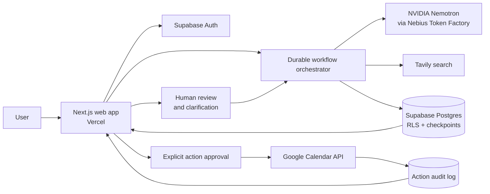

# Avenli architecture

Avenli is a server-rendered Next.js application that keeps identity, orchestration, AI providers and external actions behind authenticated server boundaries. The browser receives validated public results; provider credentials, integration tokens and model reasoning never enter client code.

## Request and trust boundaries

1. Supabase Auth establishes the user session. Every private page and API route verifies identity again on the server.
2. PostgreSQL row-level security restricts profiles, problems, workflow checkpoints, notifications, integrations and actions to their owner. Protected RPCs enforce state transitions and quotas.
3. The orchestrator runs a finite chain: Intake → Plan → Research → Verify → Options → Critique → Decide → Tasks. It saves a validated checkpoint before each next stage and can resume after a clarification or interrupted request.
4. Tavily retrieves bounded excerpts. A dedicated Researcher receives those excerpts as untrusted input and may cite only source IDs supplied by the application.
5. NVIDIA Nemotron is served through Nebius Token Factory behind a provider abstraction. Model and endpoint are configuration values, so agent code does not depend on one hard-coded deployment.
6. Zod contracts validate every agent input and output. Reference checks reject unknown sources, options, steps and tasks. Unsupported output, timeouts and provider errors fail closed with stable public error codes.
7. Agents have no executable tools. A Google Calendar write is a separate authenticated path that requires a narrow OAuth scope, a visible proposal and an explicit user approval. Idempotency and an audit log make retries reviewable.

## Runtime components

| Component | Responsibility |
| --- | --- |
| Next.js 16 / React 19 | Public site, authentication, responsive workspace and server API routes |
| Supabase Auth | Email/password and Google sign-in sessions |
| Supabase Postgres | Owner-scoped product data, checkpoints, notifications, integrations and audits |
| Nebius Token Factory | Open NVIDIA model inference for the eight typed agents |
| Tavily | Bounded web retrieval for the Researcher stage |
| Google APIs | Optional Calendar/Gmail context and explicitly approved Calendar event creation |
| Vercel | Production hosting and the bounded monitoring cron route |

## Reliability and safety

- One search and one model call per agent invocation; no unbounded autonomous loop.
- Durable revisions prevent stale or skipped workflow transitions.
- Server-side request limits, same-origin mutation checks and conservative timeouts bound cost and abuse.
- Prompt-injection regression tests verify that user text and retrieved text remain data, not system instructions.
- External actions require two review points: permission and approval of the exact payload.
- Account export, deletion, integration disconnect and analytics opt-out are available in product settings.

For implementation details, see [AI foundation](ai-foundation.md), [full orchestration](full-orchestrator.md), [persistent agent](persistent-agent.md), [external actions](actions.md) and [testing](testing-hardening.md).
